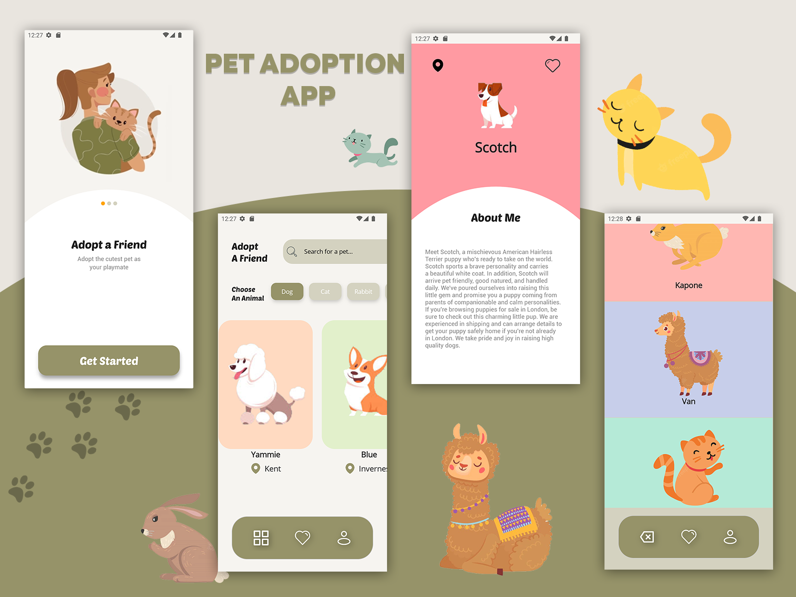

## [PetAdoptionApp](https://https://github.com/JoeTomkinson/PetAdoptionApp)

Implementation of a [Pet Adoption app UI](https://dribbble.com/shots/15845064-Pet-Adoption-App) using .NET MAUI.  
Dribble by Arinasdd 

### Supported platforms
- [x] iOS
- [x] Android

### Features
- CarouselView
- Custom Fonts
- MVVM
- DI
- MAUI Shapes

### More Info

- Source code: [https://github.com/JoeTomkinson/PetAdoptionApp](https://github.com/JoeTomkinson/PetAdoptionApp)
- Author: [Joe Tomkinson](https://joetomkinson.dev)
- Submitted to Microsofts MAUI Beautiful UI Challenge: [Showcase Repo](https://github.com/jsuarezruiz/dotnet-maui-showcase)
- Microsoft Blog Post: [MAUI UI Challenge](https://devblogs.microsoft.com/dotnet/announcing-dotnet-maui-beautiful-ui-challenge/)
